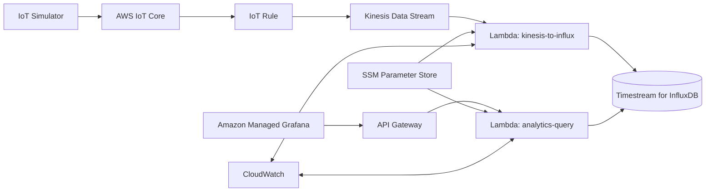

# Smart Meter IoT Platform - Architecture and Design Decisions

This document focuses on why this architecture was chosen, how components interact under load, and how the system is expected to scale.

Dashboard-level documentation is split into:
- `DASHBOARD_SHOWCASE.md`

## 1. Problem Framing
The target system ingests high-frequency smart-meter telemetry and supports two very different read patterns:
1. near-real-time operational views
2. longer-range analytical/statistical views

A single-path architecture usually fails one of these requirements. Either it becomes expensive for historical queries, or too slow for live dashboards. The implementation therefore uses a split read strategy with stream decoupling and a curated query API.

## 2. Why This Pipeline

### AWS IoT Core + IoT Rule
IoT Core is used as the MQTT/TLS ingestion edge because it natively handles certificate-based device auth and topic routing. This keeps device connectivity concerns out of custom code.

### Kinesis Data Stream
Kinesis is used as a durable ingestion buffer between producer and storage write path. This decouples bursty ingress from downstream processing and prevents direct write-pressure on the database.

Without Kinesis, direct producer-to-database writes make backpressure, retries, and burst handling much harder.

### Lambda for Ingestion (instead of direct DB write)
The ingestion Lambda performs controlled transformation (JSON -> line protocol), centralized validation, and retry behavior in one managed runtime. It also allows tuning batch and concurrency independently of producer rate.

Direct IoT Rule -> DB writes are simpler but reduce transformation control and make resilience tuning less explicit.

### InfluxDB (Timestream for InfluxDB) vs SQL/NoSQL
The workload is time-series first: frequent appends, time-window filters, bucketed aggregations, rollups, and dashboard-focused querying.

InfluxDB is a better fit than general SQL/NoSQL for this shape because:
- native time-indexed query model
- Flux operations for range and aggregate windows
- efficient rollup/downsample workflows

Traditional SQL can do this, but requires heavier schema/index tuning and often higher operational overhead for equivalent query patterns.

### Analytics Query Lambda Backend
A curated API layer was added in front of Influx reads to enforce request contracts and guardrails:
- bounded lookback
- bounded row limits
- bounded filter cardinality
- named query templates

This gives governance and protects storage from uncontrolled ad hoc query patterns.

## 3. Hot/Cold Data Strategy
The design intentionally separates short-range operational reads from long-range analytical reads.

### Hot tier (raw)
- high granularity
- short retention target (7 days)
- used for near-real-time behavior

### Cold tier (downsampled)
- 15-minute rollups (`mean`, `min`, `max`, `count`)
- long retention target (1 year)
- used for historical trend/statistical reporting

### Why this split matters
Keeping all data raw forever inflates storage and query cost. Keeping only downsampled data reduces live fidelity. Hot/cold preserves live precision while keeping historical access economical.

### Query routing behavior
The analytics Lambda routes based on time range and granularity:
- older ranges -> cold
- recent + high granularity (`1m` / `5m`) -> hot
- mixed windows -> split across both

## 4. Terraform Practices Used
The IaC structure is modular and environment-aware, with domain modules for network, ingestion, streaming, time-series storage, query API, and observability.

### Practices implemented
- module composition by domain (`terraform/modules/*`)
- shared + per-environment var files (`envs/common.tfvars`, `envs/{dev,stage,prod}`)
- remote state bootstrap (`terraform/bootstrap/state`)
- provider/version pinning
- lint/security hooks via pre-commit + tflint + tfsec
- secret indirection through SSM parameters

### Security posture in IaC
- API Gateway routes use `AWS_IAM` auth
- ingestion and query token paths are separated
- Lambda runs in VPC with SG-based DB access

## 5. Scaling Considerations
Scaling is determined by event rate, payload size, and query mix.

### Ingestion tiers (approximate)
- 1 million/day -> ~11.6 events/sec
- 10 million/day -> ~115.7 events/sec
- 100 million/day -> ~1157.4 events/sec

### Kinesis implications
Kinesis shard limits are roughly:
- 1000 records/sec write per shard
- 1 MB/sec write per shard

At 100M/day, record-rate alone exceeds one shard, so multiple shards are required. Payload size may increase shard count further.

### Lambda ingestion path
Key knobs:
- event source batch size/window
- reserved concurrency
- retry and DLQ strategy

Current tuning reduces batching window to improve freshness, which is good for live views but can increase invoke frequency/cost. This is a deliberate latency-over-cost tradeoff for operational dashboards.

### Influx query/read path
As volume grows, safeguards become mandatory:
- tight lookback limits
- capped result size
- controlled meter filter cardinality
- coarse granularity for historical windows

The current API already implements these guardrails.

## 6. Observability and Operational Validation
CloudWatch is used for runtime visibility of ingestion and query paths.

Query API emits structured logs and metrics including:
- `QuerySuccess`
- `QueryError`
- `QueryTimeout`
- `QueryDurationMs`
- `RowsReturned`

These are enough to build basic operational dashboards and alarms. Full SLO evidence (freshness/latency percentile compliance over time) should be measured continuously as a follow-up hardening step.

## 7. Current State and Practical Notes
- The core ingestion and query paths are implemented and testable.
- Hot-path dashboard queries are working.
- Cold-path reliability depends on downsampling task lifecycle; this should be treated as an explicit environment bootstrap step.
- Dashboard screenshots and panel-level explanations are documented separately in `DASHBOARD_SHOWCASE.md`.

## 8. Key Repository Paths
- Infra: `terraform/`
- Ingestion Lambda: `terraform/lambda_source/kinesis2timestream.py`
- Query Lambda: `terraform/lambda_analytics_source/analytics_query.py`
- Downsampling task script: `terraform/scripts/create_influx_downsampling_task.sh`
- Simulator: `iot-simulator/`
- Dashboards: `grafana/dashboards/`
