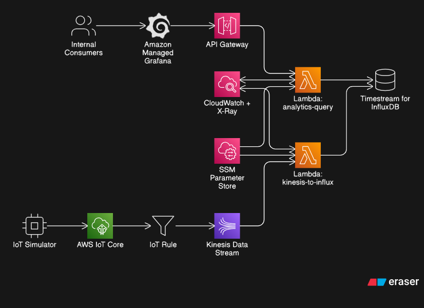

# Smart Meter IoT Ingestion Pipeline

A serverless, streaming IoT platform built on AWS for smart-meter telemetry ingestion, real-time monitoring, and historical analytics.

This project demonstrates a production-style ingestion architecture that handles high-frequency device events while keeping query performance and cost under control through a hot/cold time-series model.

## 1. Project Purpose

The primary goal of this project is to ingest millions of smart-meter readings per day in a scalable, resilient way.

Core purpose:
1. build a high-throughput asynchronous ingestion path that can absorb bursty device traffic
2. avoid fragile direct producer-to-database writes by decoupling ingest and persistence with streaming
3. support real-time operations and historical analytics on top of that ingestion foundation

Why async architecture was chosen:
1. direct writes from device paths to DB couple producer rate to database latency
2. Kinesis provides a durable ingestion buffer and backpressure boundary
3. Lambda consumers scale independently and process batches before writing to InfluxDB
4. this keeps ingestion reliable under load while still enabling controlled downstream query behavior

Smart-meter systems still need both:
1. live operational visibility for recent telemetry
2. long-range analytical visibility for trends, KPIs, and statistics

Those read workloads have different access patterns, so the design also uses hot/cold storage routing for query efficiency.

## 2. Architecture Overview

End-to-end flow:
1. IoT simulator/devices publish telemetry over MQTT/TLS
2. AWS IoT Core receives messages and routes them via IoT Rules
3. Kinesis Data Stream buffers and decouples ingestion throughput
4. Lambda consumer transforms telemetry to Influx Line Protocol
5. Amazon Timestream for InfluxDB stores time-series data
6. Analytics API (API Gateway + Lambda) serves controlled query access
7. Grafana visualizes real-time, historical, and infrastructure views

This architecture keeps producer traffic, ingestion processing, and read/query paths independently controllable.

Architecture diagram:

## 3. Core Components

### AWS IoT Core

IoT Core acts as the secure ingestion edge for MQTT traffic, including X.509 certificate-based device identity. IoT Rules route telemetry from device topics into the streaming layer without introducing custom broker logic.

### Kinesis Data Streams

Kinesis provides buffering between producers and storage writes. This absorbs bursts, protects downstream systems from ingestion spikes, and gives controlled fan-in behavior for Lambda processing.

### Ingestion Lambda

The ingestion Lambda consumes Kinesis records, parses JSON payloads, and writes structured time-series points to InfluxDB. Failures are surfaced intentionally so retries occur through standard event-source semantics.

### Timestream for InfluxDB

InfluxDB is used as the primary time-series store because the workload is time-window heavy and metric-centric. It supports efficient range queries, aggregate windows, and downsampled history.

### Analytics Query Service

A dedicated query API is placed in front of Influx reads to enforce guardrails and route requests intelligently. This prevents uncontrolled direct database querying from dashboard clients.

### Managed Grafana

Grafana provides operational and analytical dashboards. Dashboard groups are split by use case so near-live views and historical KPI views are optimized independently.

## 4. Telemetry Model and Pipeline Behavior

Each meter event carries meter identity, timestamp, and electrical measurements such as energy, voltage, and current.

Pipeline behavior:
1. device payloads are accepted by IoT Core
2. IoT Rule forwards matched topics to Kinesis
3. Lambda converts each record into time-series line protocol
4. points are written to Influx measurement storage
5. query service reads from hot and/or cold bucket based on request profile

The pipeline is intentionally simple in control flow, making it easy to reason about ingestion correctness and failure domains.

## 5. Hot/Cold Time-Series Strategy

### Hot tier
- recent raw telemetry
- high-granularity operational reads
- optimized for near-real-time monitoring

### Cold tier
- downsampled historical telemetry
- long-window analytics and reporting
- optimized for cost and historical query stability

### Routing behavior

The analytics service chooses data source based on time range and granularity. Recent high-detail requests are routed to hot storage, older/coarser requests are routed to cold storage, and overlapping windows can be split and merged.

## 6. Networking and Security Model

### Network design

The platform uses a VPC with private subnet execution paths for data services and Lambda workloads. Security groups limit database access to trusted workload boundaries.

### Security controls

1. MQTT ingress secured with TLS and device certificates
2. secrets and endpoints managed via SSM Parameter Store
3. IAM-authenticated API routes for analytics access
4. private network boundaries around ingestion/query compute and storage

This model minimizes exposed surfaces while keeping operations manageable.

## 7. Observability and Operations

Operational visibility is built around CloudWatch metrics, alarms, and structured Lambda logs.

The analytics service emits query success/error/timeout and latency/row-count signals to support:
1. service health monitoring
2. query behavior analysis
3. incident troubleshooting

Grafana dashboards complement this with business-facing and engineering-facing views across real-time telemetry, historical trends, and infrastructure health.

## 8. Deployment Summary

Terraform provisions the full stack, including:
1. IoT Core device and rule resources
2. Kinesis streaming resources
3. Lambda ingestion and query services
4. Timestream for InfluxDB resources
5. VPC networking and security groups
6. API Gateway endpoints and IAM-auth routes
7. Grafana workspace and observability integrations

Environment separation is managed through environment-specific variable files so dev, stage, and prod can evolve safely.

## 9. Scaling Profile (Million Readings/Day)

Approximate ingest rate by daily volume:
1. 1M/day -> ~11.6 readings/sec
2. 10M/day -> ~115.7 readings/sec
3. 50M/day -> ~578.7 readings/sec
4. 100M/day -> ~1157.4 readings/sec
5. 250M/day -> ~2893.5 readings/sec

Where scaling pressure appears first:
1. Kinesis shard capacity and partition distribution
2. Lambda event-source throughput (batch size, concurrency, retries)
3. Influx write throughput and query contention during heavy dashboard refresh windows

Kinesis scaling notes:
- Stream is provisioned mode, so shard count must match expected peak throughput.
- As a practical rule, validate both records/sec and bytes/sec, then add headroom for burst traffic.
- For higher-volume tiers (for example ~100M/day+), shard count and producer partition behavior should be reviewed before load tests.

Lambda scaling notes:
- Event source mapping currently uses batch size 100 and 1-second batching window.
- Effective throughput depends on records per batch, average write latency to Influx, and retry rate on failures.
- For sustained high ingest, tune reserved concurrency, batch size/window, and error-handling strategy together.

Operational scaling metrics to watch:
1. Kinesis: IncomingRecords, IncomingBytes, GetRecords iterator age
2. Lambda: ConcurrentExecutions, Duration, Errors, Throttles
3. Analytics API: query timeout/error rates and p95 duration
4. Influx path: write latency and query latency during dashboard peaks

## 10. Current Outcome

This project successfully implements:
1. secure IoT telemetry ingestion over MQTT
2. decoupled stream-based ingestion processing
3. private time-series storage path in InfluxDB
4. controlled API-based analytics access
5. real-time plus historical dashboard-ready query capabilities

The resulting system reflects real-world ingestion architecture patterns used in utility and smart-grid telemetry platforms.

## 11. Dashboards and Project Story

Dashboard documentation lives in `DASHBOARDS.md`.

The dashboard suite is part of the project writeup, not just visualization extras. It demonstrates:
1. real-time operational monitoring behavior from the hot path
2. historical/statistical behavior from the cold path
3. infrastructure-level health and ingestion/query bottlenecks

In short, dashboards are the proof layer showing that the ingestion architecture is working as designed.

## 12. Known Gaps and Next Evolution

Highest-value next improvements:
1. fully automate cold-tier retention/downsampling lifecycle in Terraform
2. complete Grafana datasource/token automation end-to-end
3. tighten IoT policy scope and cert-rotation operational workflow
4. implement dead-letter queue retry and failure-data handling pipeline (not implemented yet; failed ingestion records are not automatically replayed today)
5. add deeper query tracing and optional caching for dashboard-heavy workloads
6. further harden data-quality validation in ingestion and analytics paths

## 13. Conclusion

The Smart Meter IoT Ingestion Pipeline achieves its main goal: reliable high-frequency telemetry ingestion with a practical balance between live operational visibility and scalable historical analytics.

It is a strong end-to-end foundation that can be extended toward full production hardening with focused improvements in automation, governance, and performance tuning.
