# Dashboard Showcase

This file documents the dashboard set built for the Smart Meter IoT platform with embedded screenshots.

How this fits the project writeup:
- `ABOUT.md` explains architecture and scaling model.
- This file shows the visual proof layer for real-time behavior, historical analytics, and infra health.

## Data Sources Used
- Analytics API (`/v1/query/timeseries`, `/v1/query/statistics`) via signed HTTP calls
- CloudWatch metrics for ingestion/query operational health
- Hot/cold query routing behavior from the analytics service (recent vs historical windows)

## AWS Managed Grafana Dashboard List

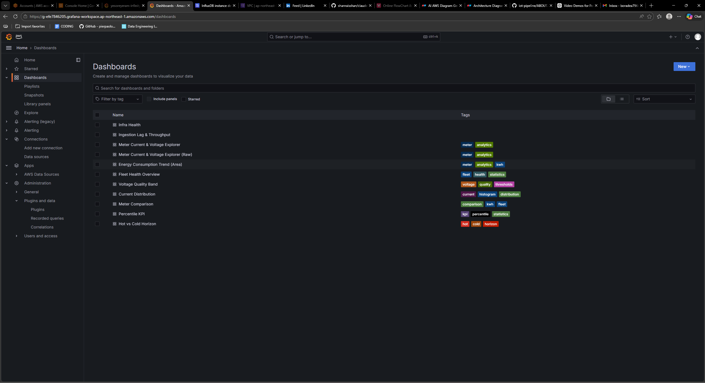

## 1. Real-Time Dashboard Group

### A. Real-Time Meter (`real-time-meter.json`)
Purpose:
- near-live view of current, voltage, and energy behavior
- operator-facing monitoring for active ingest windows

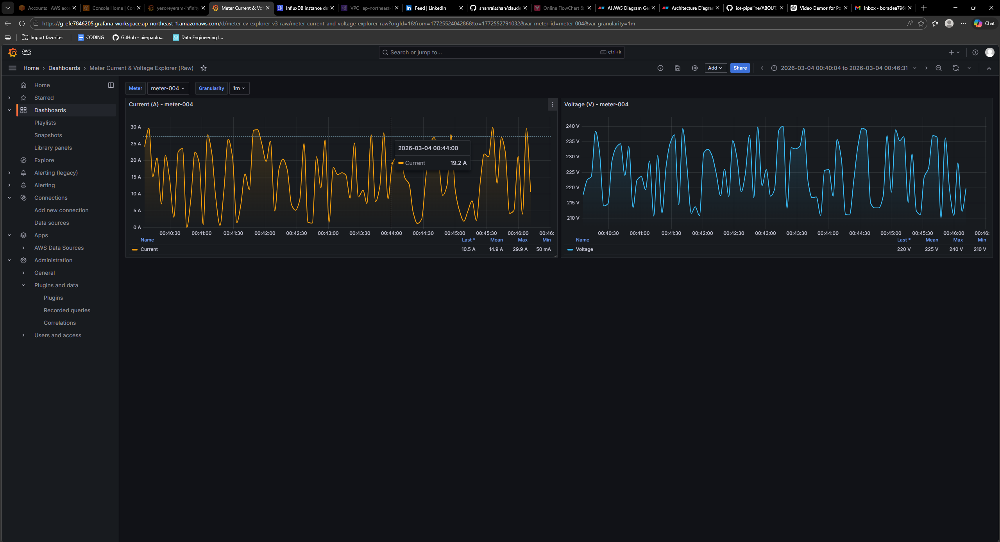

### B. Voltage Quality Band (`voltage-quality-band.json`)
Purpose:
- highlight voltage values against acceptable operating bands
- visually surface instability and excursions

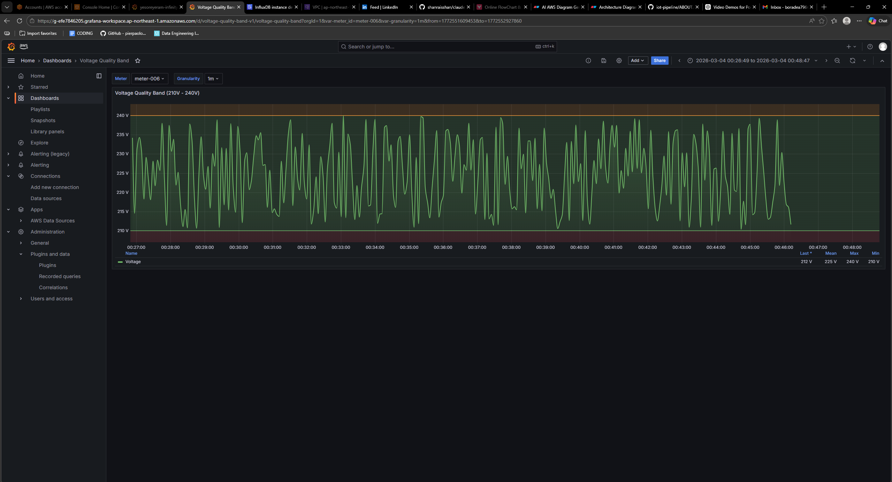

### C. Current Distribution (`current-distribution.json`)
Purpose:
- understand load profile distribution
- detect skew/heavy-tail behavior across sampled intervals

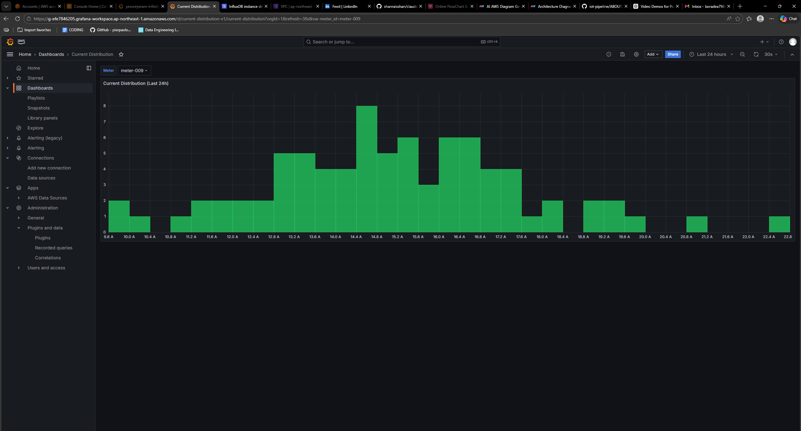

### D. Ingestion Lag & Throughput (`ingestion-lag-throughput.json`)
Purpose:
- track ingestion health and end-to-end pipeline behavior
- identify spikes, lag increases, or drops in ingestion rate

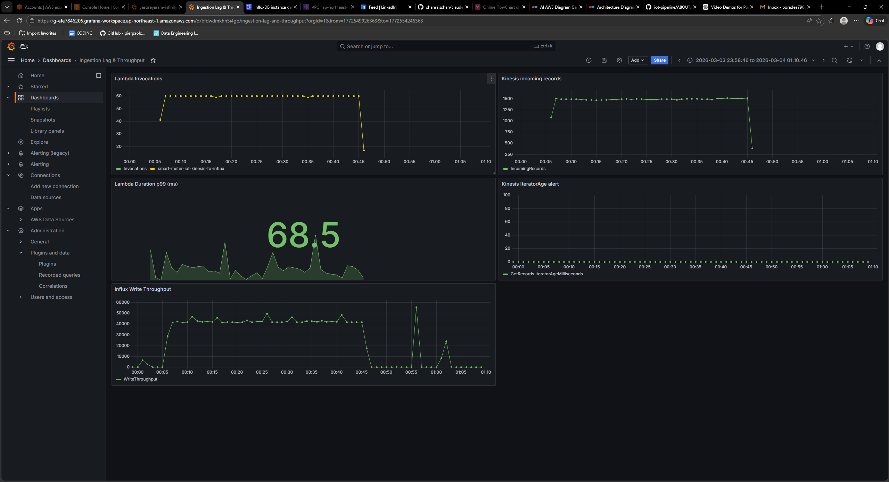

## 2. Historical / Analytics Dashboard Group

### A. Hot vs Cold Horizon (`hot-vs-cold-horizon.json`)
Purpose:
- compare recent high-resolution windows to long-range rolled-up history
- validate tiering behavior and route expectations

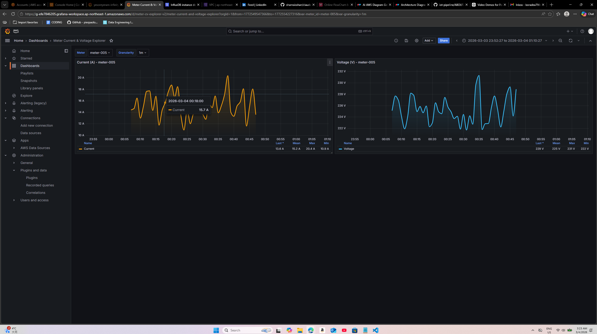

### B. Fleet Health Overview (`fleet-health-overview.json`)
Purpose:
- aggregate fleet-level behavior and identify outliers quickly
- provide operational summary panel set

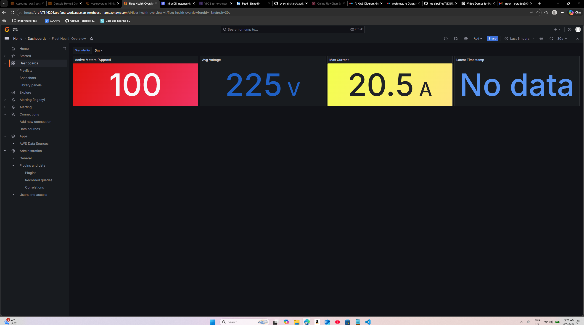

### C. Meter Comparison Top 5 (`meter-comparison-top5.json`)
Purpose:
- compare highest-impact meters over selected interval
- identify concentration patterns in usage/load

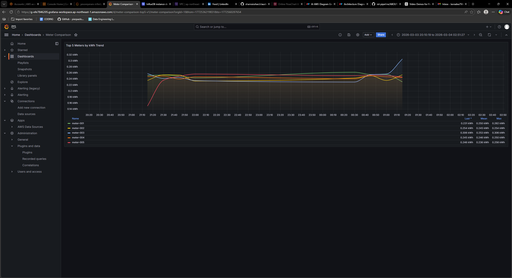

### D. Percentile KPI (`percentile-kpi.json`)
Purpose:
- present statistical indicators (percentile-oriented KPIs)
- support trend + threshold interpretation

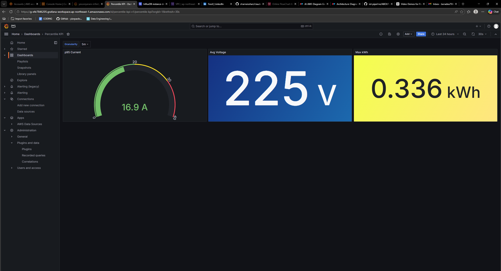

### E. Energy Consumption Trend (`enery-consumption-trend.json`)
Purpose:
- show energy trend and directional movement over time
- support reporting and planning views

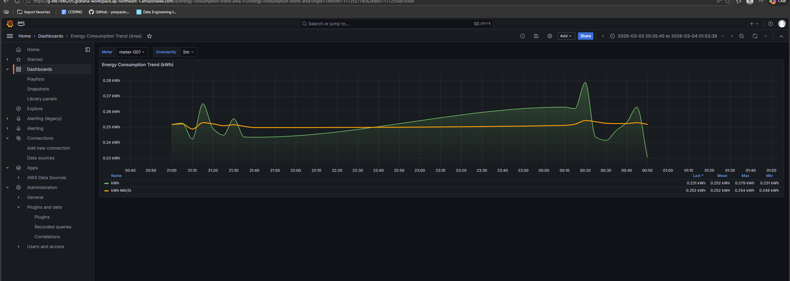

## 3. Supporting Infra Dashboard

### Infra Health (`infra-health.json`)
Purpose:
- cloud resource-level health and runtime signal visibility
- quick correlation view for incidents

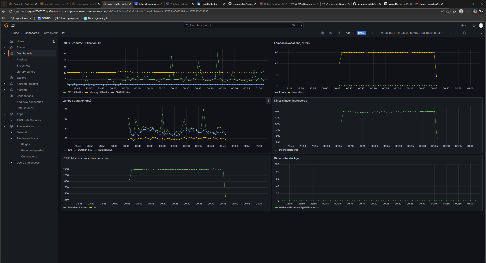

## 4. How to Read This Dashboard Set
- Real-time group is for short-window operational awareness.
- Historical group is for trend, comparison, and statistical interpretation.
- Infra group supports root-cause investigation and service health checks.

## 5. Scaling Signals to Watch in Dashboards
As ingest volume moves from low millions/day toward tens or hundreds of millions/day, focus on:
1. Ingestion lag and throughput trend divergence
2. Query latency increase on real-time panels
3. Error/timeout growth on analytics-backed panels
4. Hot vs cold split behavior for longer date ranges

These signals indicate when to tune Kinesis shard count, Lambda throughput configuration, or query guardrails.
